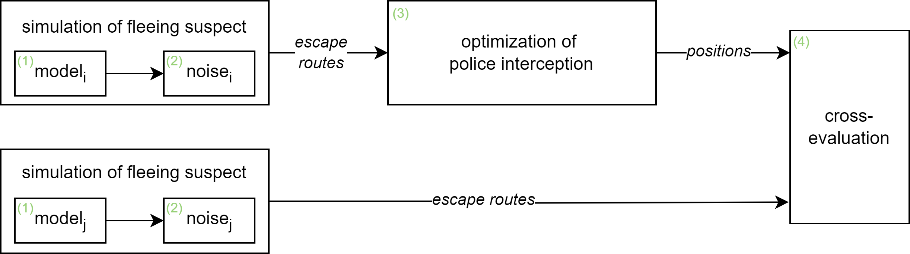

# Modeling route-choice

Flow and files
- prep_graph_*.ipynb (e.g., [prep_graph_Manhattan.ipynb](prep_graph_Manhattan.ipynb) import the graph from OpenStreetMap and the camera data from the data folder. The output of these files is the plotted graph of the respective area and the saved graphs.
- [enrich_graph_cool.ipynb](enrich_graph_cool.ipynb) and [enrich_graph_cool.ipynb](enrich_graph_cool.ipynb) import the relevant factors from OpenStreetMap and other data sources. These factors are used to create the graph attribute 'travel_time_adj' which reflects the attractiveness of a particular road segment. After, the best routes from the incident to each of the defined escape nodes are generated and saved.
- [run_model_cool.py](run_model_cool.py) and [run_model_hot.py](run_model_hot.py) import the escape routes and pass them to a pyDSOL model, which adds a jitter factor to the routes. The output of these files is the resulting, final simulated escape routes.
- [optimize/optimize_positions.py](optimize/optimize_positions.py) import the resulting routes and optimizes the positions of the police units. The optimized positions and the resulting interception dictionary (reflecting which routes are intercepted by the chosen strategy) are saved.
- In [optimize/cross_evaluation_optimization.ipynb](optimize/cross_evaluation_optimization.ipynb), these positions and the routes are imported to evaluate their relative robustness. I.e., how well does a strategy perform on a set of routes generated using a different rationale or profile - also see the figure below. The resulting heatmaps are saved in the [optimize/](optimize/) folder. 

